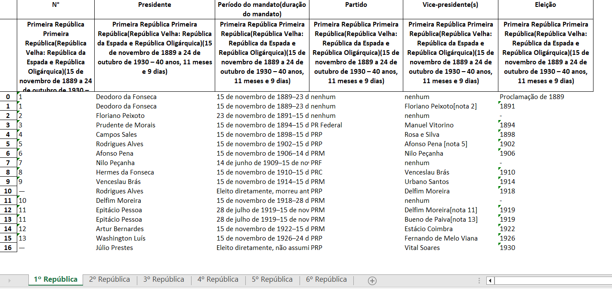

# Todos os Presidentes do Brasil
Este é um rojeto de extração de dados em Python para criar uma base de dados com todos os presidentes do Brasil de 1891 até hoje.

### **Biblioteca utilizada**: *Pandas* 

### **Url dos dados**: <https://pt.wikipedia.org/wiki/Lista_de_presidentes_do_Brasil>  

### Espaço amostral : 1891 - Jan/2023

### Metodologia:
* Importação do *Pandas*
* Busca da Tabela na URL
* Limpeza de colunas desnecessárias
* Separação da Tabela em 6, de acordo com cada período
* Transformação das Tabelas em abas no excel

### Imagem da planilha extraída

O projeto pode ser evoluído para uma análise posteriormente.